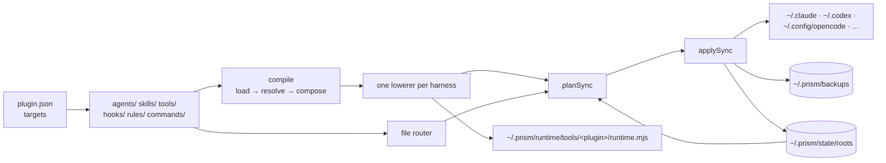

<p align="center">
  
</p>

<h1 align="center">prism</h1>

<p align="center"><strong>prism compiles one agent source into every coding harness's native config.</strong></p>

<p align="center">
  Agents, skills, tools, and hooks written once, installed native in Claude Code, Codex, OpenCode, Grok, Kimi, Amp, Cursor, Pi, and more.
</p>

<p align="center">
  <code>npm install -g @skastr0/prism</code>
  ·
  <a href="https://www.npmjs.com/package/@skastr0/prism">npm</a>
</p>

**Status:** usable, with gaps · v0.8.0 (2026-09-23) · macOS and Linux · formats may still change

---

## The pain

- **Every harness keeps its own copy.** You fix a skill in one place; days later a Codex session trips on the old copy in `~/.codex/skills`, and the agent spends its turn working out why.
- **Your agent setup lives in dotfiles.** Agents, skills, and hooks spread across `~/.claude`, `~/.codex`, `~/.config/opencode`: unversioned, unreviewed, drifting apart.
- **Several harnesses on one task means glue.** Shell scripts, copy-paste, and no typed contract on what comes back.

## What prism does

<p align="center">
  
</p>

You keep one plugin directory in Git. `prism refresh` writes each harness's own format into its own config directory, and running it again writes nothing. A managed file you edited is repaired, with a backup taken first. A file prism never wrote is refused.

prism can also send typed tasks to the harness CLIs you have installed, and rejects any answer that doesn't decode into the task's schema.

| prism **is** | prism **is not** |
|---|---|
| A compiler from one typed source to each harness's native format | A lowest-common-denominator wrapper |
| A workflow runner that drives the harness CLIs you already use, with their logins | An SDK that calls model APIs |
| Tools as a stateless CLI, loaded in-process | A daemon or an MCP server |
| Idempotent: refresh twice, the second run writes nothing | A dotfile templater that overwrites your config |

## Quick start

```bash
npm install -g @skastr0/prism
```

```bash
# 1. Scaffold a plugin with an agent, a skill, and TypeScript tooling
prism init my-standards --with-agent --with-skill --typescript

# 2. Preview what would be written, per harness
prism plan my-standards --all

# 3. Write it for the harnesses you use
prism refresh my-standards --harness claude-code,codex-cli,opencode

# 4. Check state and config health
prism doctor
```

Step 3, trimmed:

```text
📦 Refreshing plugin: my-standards v0.1.0
🛠  Compile (claude-code, global):
create    ~/.claude/skills/prism-generated-my-standards/agents/reviewer.md (new)
create    ~/.claude/skills/prism-generated-my-standards/skills/example-skill/SKILL.md (new)
🛠  Compile (opencode, global):
create    ~/.config/opencode/agents/reviewer.md (new)
patch     ~/.config/opencode/opencode.json [agent.reviewer.mode, agent.reviewer.model, agent.reviewer.temperature, agent.reviewer.tools]
   codex-cli ~/.codex: create=2, patch-regions=1
     create        ~/.codex/skills/example-skill/SKILL.md (new)
     patch-regions ~/.codex/AGENTS.md
✅ Done.
```

Run it again:

```text
✅ Already converged — nothing written.
```

`prism validate <plugin>` checks a plugin's structure before you refresh.

## Drift and ownership

prism tracks what it wrote. It repairs its own files and leaves yours alone.

```text
$ echo "hand edit" >> ~/.codex/prompts/test.md
$ prism refresh my-standards --harness codex-cli
     repair        ~/.codex/prompts/test.md (drifted)
💾 Backups created:
   ~/.prism/backups/20260924T072528-90hq2s/6b735ac615030cb6/prompts/test.md

# a file prism never wrote is already at that path
$ prism refresh my-standards --harness codex-cli
⛔ Refusing to overwrite a file Prism does not manage: ~/.codex/prompts/test.md
  hint: a file Prism has never managed already exists here with different content — delete or move it, then refresh
```

| state | where |
|---|---|
| what prism owns, per harness root | `~/.prism/state/roots/*.json` |
| backups (never `.bak` files next to your config) | `~/.prism/backups/` |
| settings, including backup retention | `~/.prism/config.json` |

Set `PRISM_HOME` to move all of it. Shared files such as `AGENTS.md`, `CLAUDE.md`, and `config.toml` get a fenced region; prism never takes over the whole file.

## How it works



`plugin.json` says which harnesses get each kind of artifact. TypeScript sources (`*.agent.ts`, `*.tool.ts`, `*.hook.ts`, `*.sop.ts`) go through a lowerer per harness; markdown rules, commands, and skills are routed as files. Every write goes through one planner and one writer. What each harness supports is declared in [`src/lowerer-capabilities.ts`](src/lowerer-capabilities.ts), and a target that can't carry an artifact fails validation instead of being skipped.

## Harnesses

`prism harnesses` lists 14 targets:

| Harness | ID | Global | Project | Tested |
|---|---|---|---|---|
| Claude Code | `claude-code` | `~/.claude/` | `.claude/` | live |
| OpenCode | `opencode` | `~/.config/opencode/` | `.opencode/` | live |
| Codex CLI | `codex-cli` | `~/.codex/` | `.codex/` | live |
| Grok Build | `grok` | `~/.grok/` | `.grok/` | live |
| Kimi Code | `kimi-code` | `~/.kimi-code/` | — | live |
| Amp Code | `amp-code` | `~/.config/amp/` | `.agents/` | live |
| Antigravity CLI | `antigravity-cli` | `~/.gemini/antigravity-cli/` | `.agents/` | live |
| Oh My Pi | `omp` | `~/.omp/agent/` | `.omp/` | live |
| Devin CLI | `devin` | `~/.config/devin/` | `.devin/` | live |
| Hermes Agent | `hermes` | `~/.hermes/` | — | live (no agents) |
| Cursor | `cursor` | `~/.cursor/` | `.cursor/` | compile-checked only |
| Pi | `pi` | `~/.pi/agent/` | `.pi/` | compile-checked only |
| Amp Orb | `amp-orb` | `~/.prism/amp-orb/` | — | skills into a hosted checkout (`--root`), plus workflow tasks |
| Amp Runner | `amp-runner` | `~/.prism/amp-runner/` | — | workflow tasks only |

`--all` covers the first twelve. "Compile-checked only" means the generated output is pinned by golden tests but hasn't been loaded by the live harness. Per-harness surfaces (plugin bundle, TypeScript plugin API, config patch, or plain files) are in [`docs/lowerer-capability-matrix.md`](docs/lowerer-capability-matrix.md).

## Authoring

Six typed source contracts, exported from `prism`:

| Contract | Declares |
|---|---|
| `AgentSource` | an agent: identity, model, skills, harness targets |
| `ToolSource` | a tool: Effect Schema input and output, one `handle` |
| `HookSource` | a lifecycle hook: event, matcher, handler |
| `SopSource` | a procedure in phases, lowered to a skill |
| `ModelspaceSource` | named model profiles, resolved per harness |
| `SkillspaceSource` | skill names, mapped per harness |

A tool, written once ([`examples/prism-harness-qa/tools/challenge_echo.tool.ts`](examples/prism-harness-qa/tools/challenge_echo.tool.ts)):

```ts
import { Schema } from "effect";
import type { ToolSource } from "prism";
import { challengeProof } from "./proof";

export default {
  name: "challenge_echo",
  description: "Returns a keyed proof that this generated Prism tool executed.",
  input: Schema.Struct({ challenge: Schema.String }),
  output: Schema.Struct({
    challenge: Schema.String,
    proof: Schema.String,
    source: Schema.Literal("prism-generated-tool"),
  }),
  handle(input) {
    return {
      challenge: input.challenge,
      proof: challengeProof(input.challenge),
      source: "prism-generated-tool" as const,
    };
  },
} satisfies ToolSource;
```

After `prism refresh`, any agent that can run a shell command calls it:

```text
$ prism tools invoke prism-harness-qa challenge_echo --input '{"challenge":"hello"}'
{
  "challenge": "hello",
  "proof": "prism-tool-proof:hello",
  "source": "prism-generated-tool"
}

$ prism tools invoke prism-harness-qa challenge_echo --input '{"nope":1}'
{ "error": "Expected no excess property\n  at [\"nope\"]" }
```

OpenCode, Amp, Pi, and OMP also register the same tool through their own plugin APIs. Design: [`docs/tools-architecture.md`](docs/tools-architecture.md). Pinning skills from other Git repos: [`docs/third-party-skills.md`](docs/third-party-skills.md).

## Workflows

A workflow task runs a harness CLI you have installed, and its answer must decode into a schema:

```ts
import { Schema } from "effect";
import { defineTask, defineWorkflow } from "prism";

const countHarnesses = defineTask({
  id: "count-harnesses",
  prompt: "List every harness id in src/types.ts HarnessId. Return them and the count.",
  output: Schema.Struct({ harnessIds: Schema.Array(Schema.String), count: Schema.Number }),
  worker: { worker: "codex-cli", permission: "sandbox-read-only" },
});

export default defineWorkflow({ name: "count-harnesses", tasks: [countHarnesses] });
```

```text
$ prism workflow typecheck count.workflow.ts
Workflow typecheck passed: count.workflow.ts

$ prism workflow run count.workflow.ts --mock-output bad.json      # "count": "one"
❌ Workflow run failed: workflow task count-harnesses returned output that failed schema decode

$ prism workflow run count.workflow.ts
{
  "runId": "1abbc6fa-a658-4644-81bf-c134f1cbfe49",
  "tasks": [{
    "id": "count-harnesses",
    "output": { "harnessIds": ["claude-code", "opencode", "hermes", "codex-cli", "antigravity-cli", "kimi-code",
                "amp-code", "amp-orb", "amp-runner", "cursor", "pi", "omp", "grok", "devin"], "count": 14 },
    "status": "completed",
    ...
```

Runs, tasks, and events are stored in SQLite; `prism workflow runs list` reads them back. A live run uses your harness login and spends its tokens, with no timeout or cost cap; `--mock-output` rehearses a workflow for free. Fan-out across harnesses, finish criteria, repair loops, caching, phases, and named task configurations: [`docs/workflows.md`](docs/workflows.md).

## Known issues

- A `codex-cli` workflow task fails outside a Git repo (`Not inside a trusted directory and --skip-git-repo-check was not specified`). Run it from a Git repo.

## Where it fits

prism gives agents working together the same skills, rules, and tools, whatever harness each one runs in. [quasar](https://github.com/skastr0/quasar) ships its tools as a prism plugin. More at [castro.engineer/projects/prism](https://castro.engineer/projects/prism).

## Packages

| Package | What it is |
|---|---|
| [`@skastr0/prism`](https://www.npmjs.com/package/@skastr0/prism) | The CLI, with binaries for `darwin-arm64`, `darwin-x64`, `linux-arm64`, `linux-x64` |
| [`@skastr0/prism-sdk`](https://www.npmjs.com/package/@skastr0/prism-sdk) | Core contracts and codecs |
| [`@skastr0/prism-packager`](https://www.npmjs.com/package/@skastr0/prism-packager) | Compile a plugin into harness-native files without the CLI |

## Development

```bash
bun install
bun run build
bun test
```

More in [CONTRIBUTING.md](CONTRIBUTING.md). Changes: [CHANGELOG.md](CHANGELOG.md).

## Security

Report suspected vulnerabilities privately. See [SECURITY.md](SECURITY.md).

## License

MIT. See [LICENSE](LICENSE).
